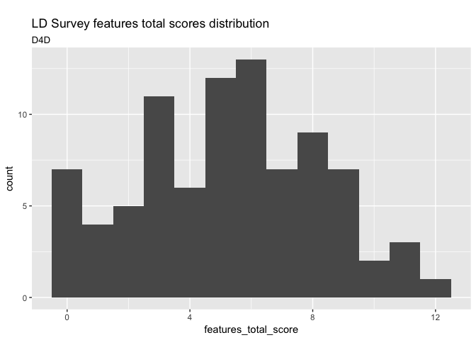

```r
# Load libraries

library(tidyverse)
```

```
## Loading tidyverse: ggplot2
## Loading tidyverse: tibble
## Loading tidyverse: tidyr
## Loading tidyverse: readr
## Loading tidyverse: purrr
## Loading tidyverse: dplyr
```

```
## Conflicts with tidy packages ----------------------------------------------
```

```
## filter(): dplyr, stats
## lag():    dplyr, stats
```

```r
library(tidytext)
library(knitr)
library(stringr)
library(kableExtra)


# Load data
ld_survey <- read_csv("data/ld_survey_anonymized_20180301.csv")
```

```
## Parsed with column specification:
## cols(
##   response_id = col_character(),
##   linked_data_benefits = col_character(),
##   reviewer1_benefits_quality = col_integer(),
##   reviewer2_benefits_quality = col_integer(),
##   reviewer3_benefits_quality = col_integer(),
##   reviewer4_benefits_quality = col_integer(),
##   features_score_total = col_integer()
## )
```

```r
names(ld_survey) <- c("response_id", "ld_features", "rev1_score", "rev2_score", "rev3_score", "rev4_score", "features_total_score")
```


# Highest features score


```r
ld_survey %>%
  top_n(1, wt = features_total_score) %>%
  kable("html") %>%
  kable_styling(bootstrap_options = c("striped", "hover", "condensed"))
```

<table class="table table-striped table-hover table-condensed" style="margin-left: auto; margin-right: auto;">
 <thead>
  <tr>
   <th style="text-align:left;"> response_id </th>
   <th style="text-align:left;"> ld_features </th>
   <th style="text-align:right;"> rev1_score </th>
   <th style="text-align:right;"> rev2_score </th>
   <th style="text-align:right;"> rev3_score </th>
   <th style="text-align:right;"> rev4_score </th>
   <th style="text-align:right;"> features_total_score </th>
  </tr>
 </thead>
<tbody>
  <tr>
   <td style="text-align:left;"> R_2UhZKI64KvRAZO4 </td>
   <td style="text-align:left;"> 15cBOOKTRADE is using linked data to create maps to show the distribution of early printed resources. Library users will be able to trace libraries of individual collectors, or trace the paths individual books from their printing to the present.
The Linked Jazz project uses name authority records in VIAF to link names mentioned in documents. This allows for deeper searching of documents by linking specific pieces of text within a document, rather than a whole document. This will help users conduct detailed research on jazz musicians.
In special collections and rare book librarianship, item-level metadata is very important. This information allows users to identify copy-specific information, such as localized bindings, trace former owners, find text corrections, and so forth. However, current tools do not support this work well. Item-level data tends to reside in local catalogs. As a result, users who start their research in WorldCat risk missing this valuable information completely. Although this project is in its early stages, the rare book community is hoping to leverage linked data to provide item-specific metadata in a more searchable way. This would make special collections more discoverable, and enable users to search for specific provenance information (e.g., reconstructing a library that's been dispersed). </td>
   <td style="text-align:right;"> 3 </td>
   <td style="text-align:right;"> 2 </td>
   <td style="text-align:right;"> 3 </td>
   <td style="text-align:right;"> 4 </td>
   <td style="text-align:right;"> 12 </td>
  </tr>
</tbody>
</table>

# Lowest features total scores


```r
ld_survey %>%
  top_n(-1, wt = features_total_score) %>%
  kable("html") %>%
  kable_styling(bootstrap_options = c("striped", "hover", "condensed"))
```

<table class="table table-striped table-hover table-condensed" style="margin-left: auto; margin-right: auto;">
 <thead>
  <tr>
   <th style="text-align:left;"> response_id </th>
   <th style="text-align:left;"> ld_features </th>
   <th style="text-align:right;"> rev1_score </th>
   <th style="text-align:right;"> rev2_score </th>
   <th style="text-align:right;"> rev3_score </th>
   <th style="text-align:right;"> rev4_score </th>
   <th style="text-align:right;"> features_total_score </th>
  </tr>
 </thead>
<tbody>
  <tr>
   <td style="text-align:left;"> R_25BgvIUv1wkD1va </td>
   <td style="text-align:left;"> I don't know of any. </td>
   <td style="text-align:right;"> 0 </td>
   <td style="text-align:right;"> 0 </td>
   <td style="text-align:right;"> 0 </td>
   <td style="text-align:right;"> 0 </td>
   <td style="text-align:right;"> 0 </td>
  </tr>
  <tr>
   <td style="text-align:left;"> R_3HNsyo6HY6bKhcr </td>
   <td style="text-align:left;"> I cannot provide two useful examples. </td>
   <td style="text-align:right;"> 0 </td>
   <td style="text-align:right;"> 0 </td>
   <td style="text-align:right;"> 0 </td>
   <td style="text-align:right;"> 0 </td>
   <td style="text-align:right;"> 0 </td>
  </tr>
  <tr>
   <td style="text-align:left;"> R_1r1Gmn7yuNTS9ma </td>
   <td style="text-align:left;"> Nothing more than they can already do now.  This is a clear case of the emperor having no clothing, and/or a giant bill of goods being sold to unsuspecting and tech ignorant library personnel. </td>
   <td style="text-align:right;"> 0 </td>
   <td style="text-align:right;"> 0 </td>
   <td style="text-align:right;"> 0 </td>
   <td style="text-align:right;"> 0 </td>
   <td style="text-align:right;"> 0 </td>
  </tr>
  <tr>
   <td style="text-align:left;"> R_2wzzmuRKCzj7pGz </td>
   <td style="text-align:left;"> None.
Nothing. </td>
   <td style="text-align:right;"> 0 </td>
   <td style="text-align:right;"> 0 </td>
   <td style="text-align:right;"> 0 </td>
   <td style="text-align:right;"> 0 </td>
   <td style="text-align:right;"> 0 </td>
  </tr>
  <tr>
   <td style="text-align:left;"> R_1MXvzZQHnCaFu1s </td>
   <td style="text-align:left;"> I do not think Wikipedia is a reliable source of information, so I would not connect patrons to that resource. </td>
   <td style="text-align:right;"> 0 </td>
   <td style="text-align:right;"> 0 </td>
   <td style="text-align:right;"> 0 </td>
   <td style="text-align:right;"> 0 </td>
   <td style="text-align:right;"> 0 </td>
  </tr>
  <tr>
   <td style="text-align:left;"> R_2ePgUE1yRGs6fbY </td>
   <td style="text-align:left;"> Get drowned in irrelevant data. See #2 </td>
   <td style="text-align:right;"> 0 </td>
   <td style="text-align:right;"> 0 </td>
   <td style="text-align:right;"> 0 </td>
   <td style="text-align:right;"> 0 </td>
   <td style="text-align:right;"> 0 </td>
  </tr>
  <tr>
   <td style="text-align:left;"> R_2ctPumKlvoRc9S8 </td>
   <td style="text-align:left;"> Not something I would do. </td>
   <td style="text-align:right;"> 0 </td>
   <td style="text-align:right;"> 0 </td>
   <td style="text-align:right;"> 0 </td>
   <td style="text-align:right;"> 0 </td>
   <td style="text-align:right;"> 0 </td>
  </tr>
</tbody>
</table>


```r
summary(ld_survey$features_total_score)
```

```
##    Min. 1st Qu.  Median    Mean 3rd Qu.    Max.    NA's 
##   0.000   3.000   5.000   5.264   7.500  12.000       1
```

```r
ggplot(ld_survey, aes(features_total_score)) + geom_histogram(binwidth = 1) +
  ggtitle("\nLD Survey features total scores distribution", subtitle = "D4D")
```

```
## Warning: Removed 1 rows containing non-finite values (stat_bin).
```

<!-- -->


```r
cor(ld_survey[c("rev1_score", "rev2_score", "rev3_score", "rev4_score")], use = "complete")
```

```
##            rev1_score rev2_score rev3_score rev4_score
## rev1_score  1.0000000  0.4091043  0.4578293  0.6096121
## rev2_score  0.4091043  1.0000000  0.4740627  0.4012963
## rev3_score  0.4578293  0.4740627  1.0000000  0.4761697
## rev4_score  0.6096121  0.4012963  0.4761697  1.0000000
```

