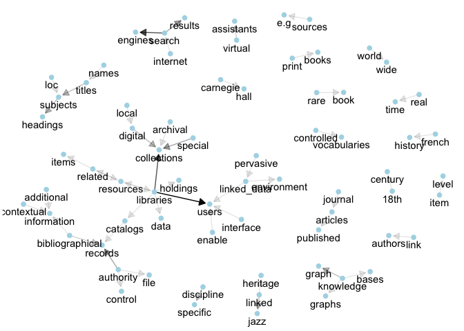

# Prepare data


```r
# Load libraries

library(tidyverse)
```

```
## Loading tidyverse: ggplot2
## Loading tidyverse: tibble
## Loading tidyverse: tidyr
## Loading tidyverse: readr
## Loading tidyverse: purrr
## Loading tidyverse: dplyr
```

```
## Conflicts with tidy packages ----------------------------------------------
```

```
## filter(): dplyr, stats
## lag():    dplyr, stats
```

```r
library(tidytext)
library(knitr)
library(stringr)
library(kableExtra)
data("stop_words")
library(igraph)
```

```
## 
## Attaching package: 'igraph'
```

```
## The following objects are masked from 'package:dplyr':
## 
##     as_data_frame, groups, union
```

```
## The following objects are masked from 'package:purrr':
## 
##     compose, simplify
```

```
## The following object is masked from 'package:tidyr':
## 
##     crossing
```

```
## The following object is masked from 'package:tibble':
## 
##     as_data_frame
```

```
## The following objects are masked from 'package:stats':
## 
##     decompose, spectrum
```

```
## The following object is masked from 'package:base':
## 
##     union
```

```r
library(ggraph)


# load libraries
# Remove responses with 0 feature total score and normalize(i.e., linked data)
clean_features_text <- function(ld_survey) {
  ld_survey_nonzero <- ld_survey %>%
    filter(features_total_score > 0)
  ld_survey_cleaned <- ld_survey_nonzero
  ld_survey_cleaned$ld_features <- str_replace_all(ld_survey_cleaned$ld_features, regex("linked data", ignore_case = TRUE), "linked_data")
  ld_survey_cleaned$ld_features <- str_replace_all(ld_survey_cleaned$ld_features, regex("linked open data", ignore_case = TRUE), "linked_data")
  ld_survey_cleaned$ld_features <- str_replace_all(ld_survey_cleaned$ld_features, regex(" lod ", ignore_case = TRUE), " linked_data ")
  return(ld_survey_cleaned)
}

# Load data
ld_survey <- read_csv("data/ld_survey_anonymized_20180301.csv")
```

```
## Parsed with column specification:
## cols(
##   response_id = col_character(),
##   linked_data_benefits = col_character(),
##   reviewer1_benefits_quality = col_integer(),
##   reviewer2_benefits_quality = col_integer(),
##   reviewer3_benefits_quality = col_integer(),
##   reviewer4_benefits_quality = col_integer(),
##   features_score_total = col_integer()
## )
```

```r
names(ld_survey) <- c("response_id", "ld_features", "rev1_score", "rev2_score", "rev3_score", "rev4_score", "features_total_score")

# clean data
ld_survey_cleaned <- clean_features_text(ld_survey)
```


# Create bigrams (after removing stop words)


```r
bigrams <- ld_survey_cleaned %>%
  unnest_tokens(bigram, ld_features, token = "ngrams", n = 2) %>% 
  select(response_id, bigram) %>% 
  arrange(response_id)

bigrams_count <- bigrams %>%
  count(bigram, sort = TRUE)

bigram_counts_separated <- bigrams %>%
  select(bigram) %>%
  separate(bigram, c("word1", "word2"), sep = " ") %>%
  filter(!word1 %in% stop_words$word, 
         !word2 %in% stop_words$word) %>%
  count(word1, word2, sort = TRUE)

bigram_counts_separated %>% 
  filter(str_detect(word1, "linked_data" ) | str_detect(word2, "linked_data"))
```

```
## # A tibble: 33 x 3
##           word1       word2     n
##           <chr>       <chr> <int>
##  1  linked_data environment     2
##  2  linked_data       users     2
##  3    pervasive linked_data     2
##  4       austen linked_data     1
##  5    clientele linked_data     1
##  6       enable linked_data     1
##  7   government linked_data     1
##  8 institutions linked_data     1
##  9           ir linked_data     1
## 10     leverage linked_data     1
## # ... with 23 more rows
```

```r
bigram_counts_separated
```

```
## # A tibble: 928 x 3
##        word1       word2     n
##        <chr>       <chr> <int>
##  1   library       users    11
##  2   library collections     8
##  3    search     engines     7
##  4    search     results     5
##  5   special collections     5
##  6 authority     records     4
##  7 knowledge       graph     4
##  8    linked        jazz     4
##  9   subject    headings     4
## 10    titles    subjects     4
## # ... with 918 more rows
```

# Graph bigrams


```r
bigram_graph <- bigram_counts_separated %>%
  filter(n > 1) %>%
  graph_from_data_frame()


set.seed(2017)
a <- grid::arrow(type = "closed", length = unit(.1, "inches"))
ggraph(bigram_graph, layout = "fr") +
  geom_edge_link(aes(edge_alpha = n), show.legend = FALSE, arrow = a, end_cap = circle(.07, 'inches')) +
  geom_node_point(color = "lightblue", size = 2) +
  geom_node_text(aes(label = name), vjust = 1, hjust = 0.5) +
  theme_void()
```

<!-- -->

```r
ggsave(plot = last_plot(), filename = "output/ld_study_bigraph.png", height = 7, width = 10, units = "in", dpi = 300)
```


