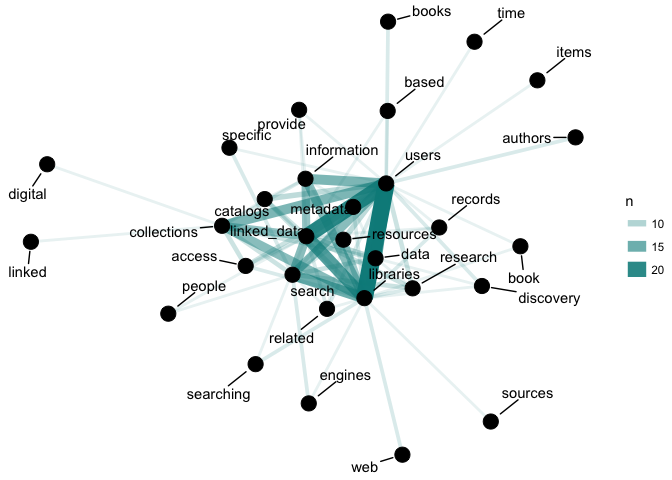
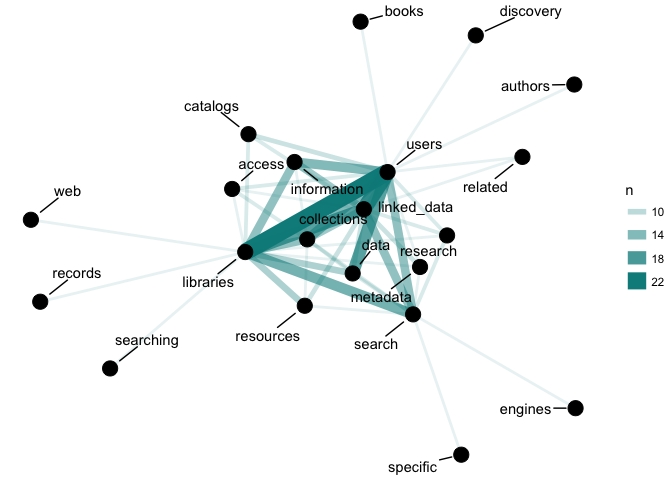
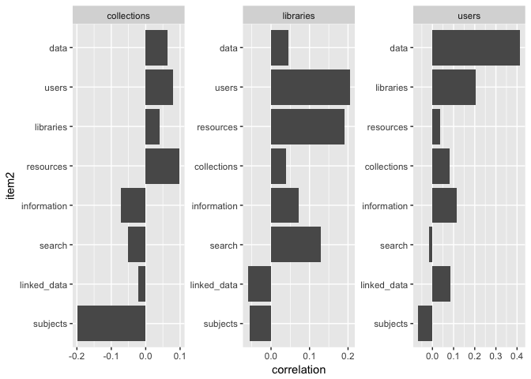
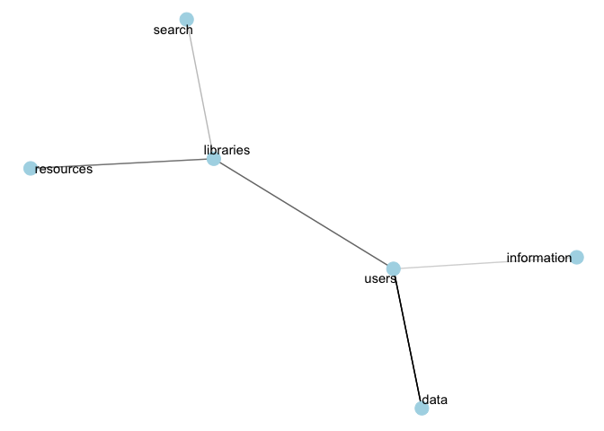

# Prepare data


```r
# Load libraries

library(tidyverse)
```

```
## Loading tidyverse: ggplot2
## Loading tidyverse: tibble
## Loading tidyverse: tidyr
## Loading tidyverse: readr
## Loading tidyverse: purrr
## Loading tidyverse: dplyr
```

```
## Conflicts with tidy packages ----------------------------------------------
```

```
## filter(): dplyr, stats
## lag():    dplyr, stats
```

```r
library(tidytext)
library(knitr)
library(stringr)
library(kableExtra)
data("stop_words")
library(igraph)
```

```
## 
## Attaching package: 'igraph'
```

```
## The following objects are masked from 'package:dplyr':
## 
##     as_data_frame, groups, union
```

```
## The following objects are masked from 'package:purrr':
## 
##     compose, simplify
```

```
## The following object is masked from 'package:tidyr':
## 
##     crossing
```

```
## The following object is masked from 'package:tibble':
## 
##     as_data_frame
```

```
## The following objects are masked from 'package:stats':
## 
##     decompose, spectrum
```

```
## The following object is masked from 'package:base':
## 
##     union
```

```r
library(ggraph)
library(widyr)


# load libraries
# Remove responses with 0 feature total score and normalize(i.e., linked data)
clean_features_text <- function(ld_survey) {
  ld_survey_nonzero <- ld_survey %>%
    filter(features_total_score > 0)
  ld_survey_cleaned <- ld_survey_nonzero
  ld_survey_cleaned$ld_features <- str_replace_all(ld_survey_cleaned$ld_features, regex("linked data", ignore_case = TRUE), "linked_data")
  ld_survey_cleaned$ld_features <- str_replace_all(ld_survey_cleaned$ld_features, regex("linked open data", ignore_case = TRUE), "linked_data")
  ld_survey_cleaned$ld_features <- str_replace_all(ld_survey_cleaned$ld_features, regex(" lod ", ignore_case = TRUE), " linked_data ")
  ld_survey_cleaned$ld_features <- str_replace_all(ld_survey_cleaned$ld_features, regex(" user ", ignore_case = TRUE), " users ")
  ld_survey_cleaned$ld_features <- str_replace_all(ld_survey_cleaned$ld_features, regex("collection ", ignore_case = TRUE), "collections ")  
  ld_survey_cleaned$ld_features <- str_replace_all(ld_survey_cleaned$ld_features, regex("resource ", ignore_case = TRUE), "resources ")  
  ld_survey_cleaned$ld_features <- str_replace_all(ld_survey_cleaned$ld_features, regex("library ", ignore_case = TRUE), "libraries ")  
  ld_survey_cleaned$ld_features <- str_replace_all(ld_survey_cleaned$ld_features, regex("author ", ignore_case = TRUE), "authors ")  

    return(ld_survey_cleaned)
}

# Load data
ld_survey <- read_csv("data/ld_survey_anonymized_20180301.csv")
```

```
## Parsed with column specification:
## cols(
##   response_id = col_character(),
##   linked_data_benefits = col_character(),
##   reviewer1_benefits_quality = col_integer(),
##   reviewer2_benefits_quality = col_integer(),
##   reviewer3_benefits_quality = col_integer(),
##   reviewer4_benefits_quality = col_integer(),
##   features_score_total = col_integer()
## )
```

```r
names(ld_survey) <- c("response_id", "ld_features", "rev1_score", "rev2_score", "rev3_score", "rev4_score", "features_total_score")

# clean data
ld_survey_cleaned <- clean_features_text(ld_survey)
```

# Pairwise counts


```r
df_ld_features <- ld_survey_cleaned %>%
  select(response_id, ld_features) %>%
  rename(id = response_id, passage = ld_features)

df_ld_features <- df_ld_features %>%
  unnest_tokens(word, passage)

df_ld_features <- df_ld_features %>%
  anti_join(stop_words)
```

```
## Joining, by = "word"
```

```r
df_ld_features %>%
  count(word, sort = TRUE)
```

```
## # A tibble: 1,101 x 2
##           word     n
##          <chr> <int>
##  1   libraries    65
##  2       users    65
##  3 linked_data    61
##  4      search    41
##  5 information    39
##  6 collections    34
##  7        data    24
##  8   resources    23
##  9    metadata    19
## 10    research    19
## # ... with 1,091 more rows
```

```r
feature_word_pairs <- df_ld_features %>%
  pairwise_count(word, id, sort = TRUE, upper = FALSE)
```

# Co-occurrence (word pair) plots


```r
set.seed(1234)

feature_word_pairs
```

```
## # A tibble: 38,287 x 3
##          item1       item2     n
##          <chr>       <chr> <dbl>
##  1   libraries       users    22
##  2 linked_data       users    20
##  3 linked_data   libraries    17
##  4       users        data    17
##  5      search   libraries    15
##  6       users collections    14
##  7       users information    14
##  8      search linked_data    13
##  9      search       users    13
## 10   libraries collections    13
## # ... with 38,277 more rows
```

```r
# macro to micro
feature_word_pairs %>%
  filter(n > 5) %>%
  graph_from_data_frame() %>%
  ggraph(layout = "fr") +
  geom_edge_link(aes(edge_alpha = n, edge_width = n), edge_colour = "cyan4") +
  geom_node_point(size = 5) +
  geom_node_text(aes(label = name), repel = TRUE, 
                 point.padding = unit(0.2, "inches")) +
  theme_void()
```

<!-- -->

```r
feature_word_pairs %>%
  filter(n > 6) %>%
  graph_from_data_frame() %>%
  ggraph(layout = "fr") +
  geom_edge_link(aes(edge_alpha = n, edge_width = n), edge_colour = "cyan4") +
  geom_node_point(size = 5) +
  geom_node_text(aes(label = name), repel = TRUE, 
                 point.padding = unit(0.2, "inches")) +
  theme_void()
```

<!-- -->

```r
feature_word_pairs %>%
  filter(n > 10) %>%
  graph_from_data_frame() %>%
  ggraph(layout = "fr") +
  geom_edge_link(aes(edge_alpha = n, edge_width = n), edge_colour = "cyan4") +
  geom_node_point(size = 5) +
  geom_node_text(aes(label = name), repel = TRUE, 
                 point.padding = unit(0.2, "inches")) +
  theme_void()
```

<!-- -->

# Pairwise correlation


```r
word_cors <- df_ld_features %>%
  group_by(word) %>%#
  filter(n() >= 20) %>%
  pairwise_cor(word, id, sort = TRUE)

word_cors %>%
  filter(item1 %in% c("collections", "users", "libraries")) %>%
  group_by(item1) %>%
  top_n(10) %>%
  ungroup() %>%
  mutate(item2 = reorder(item2, correlation)) %>%
  ggplot(aes(item2, correlation)) +
  geom_bar(stat = "identity") +
  facet_wrap(~ item1, scales = "free") +
  coord_flip()
```

```
## Selecting by correlation
```

<!-- -->

```r
set.seed(2016)

word_cors %>%
  filter(correlation > .10) %>%
  graph_from_data_frame() %>%
  ggraph(layout = "fr") +
  geom_edge_link(aes(edge_alpha = correlation), show.legend = FALSE) +
  geom_node_point(color = "lightblue", size = 5) +
  geom_node_text(aes(label = name), repel = TRUE) +
  theme_void()
```

<!-- -->

```r
feature_word_pairs %>%
  filter(n > 10)
```

```
## # A tibble: 15 x 3
##          item1       item2     n
##          <chr>       <chr> <dbl>
##  1   libraries       users    22
##  2 linked_data       users    20
##  3 linked_data   libraries    17
##  4       users        data    17
##  5      search   libraries    15
##  6       users collections    14
##  7       users information    14
##  8      search linked_data    13
##  9      search       users    13
## 10   libraries collections    13
## 11   libraries information    13
## 12 linked_data collections    12
## 13 linked_data information    12
## 14   resources   libraries    11
## 15   libraries        data    11
```

